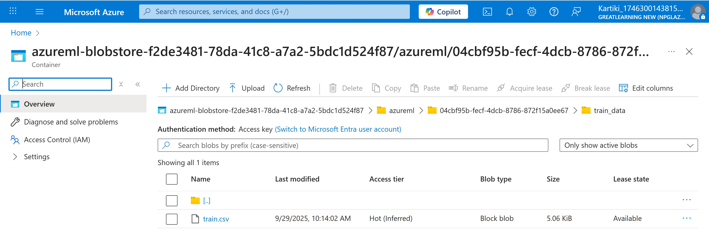
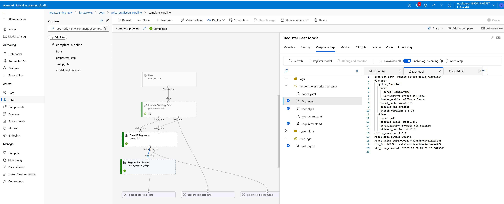

# MLOps on Azure
## Streamlining Auto Vehicle Pricing through MLOps

#### Problem Statement:
An automobile dealership in Los Vegas specializes in selling luxury and non-luxury vehicles. They cater to diverse customer preferences with varying vehicle specifications, such as mileage, engine capacity, and seating capacity. However, the dealership faces significant challenges in maintaining consistency and efficiency across its pricing strategy due to reliance on manual processes and disconnected systems. Pricing evaluations are prone to errors, updates are delayed, and scaling operations are difficult as demand grows. These inefficiencies impact revenue and customer trust. Recognizing the need for a reliable and scalable solution, the dealership is seeking to implement a unified system that ensures seamless integration of data-driven pricing decisions, adaptability to changing market conditions, and operational efficiency.

